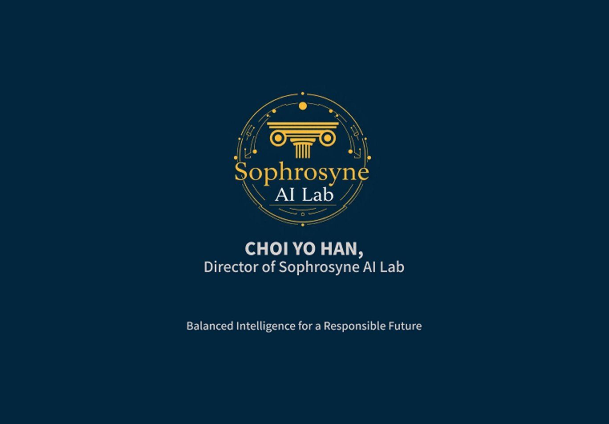

# 📖 소요리문답 암기왕 (Catechism Master)

<p align="center">
  
</p>

교회 주일학교 학생(초등~중고등)을 위한 웨스트민스터 소요리문답 학습 웹앱

## 🎯 주요 기능

| 기능 | 설명 |
|------|------|
| 🃏 **플래시카드** | 카드를 넘기며 문답 암기 |
| ✍️ **빈칸 채우기** | 핵심 단어 퀴즈 |
| 🔗 **매칭 게임** | 문과 답 연결 게임 |
| 📊 **통계** | 학습 진도 및 정답률 확인 |

## 👥 대상별 모드

- **🧒 초등부**: 핵심 20문
- **📚 중고등부**: 전체 107문

## 🚀 사용 방법

### 로컬 실행
```bash
cd catechism-master
python -m http.server 8080
# 브라우저에서 http://localhost:8080 접속
```

### GitHub Pages 배포
1. GitHub에서 새 리포지토리 생성 (`catechism-master`)
2. 이 폴더의 모든 파일 업로드
3. Settings → Pages → Deploy from branch → main
4. 배포 URL: `https://[username].github.io/catechism-master`

## 📁 파일 구조

```
catechism-master/
├── index.html
├── css/style.css
├── js/
│   ├── data.js
│   ├── storage.js
│   └── app.js
├── assets/
│   └── logo.jpg
├── README.md
└── LICENSE
```

## ✨ 특징

- 📱 모바일 친화적 반응형 디자인
- 🌙 다크/라이트 테마 지원
- 💾 진도 자동 저장 (LocalStorage)
- 🎮 게임화 요소 (연속 정답, 통계)

---

<p align="center">
  <strong>© 2025 Sophorsyne AI Lab</strong>
</p>
